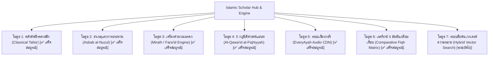

# 🗺️ Islamic Knowledge Base & Agent: Roadmap & Technical Backlog (Backdrop)

> **สถานะระบบ:** ดำเนินการพัฒนาโมดูลหลักเสร็จสมบูรณ์ 100% (Completed & Verified) ครอบคลุมทั้ง Python Backend (`rag_engine.py`), Interactive UI Explorer (`Islam_Interactive_Explorer.html`), และชุดทดสอบ 4 มิติ 71 เคส (`test_suite_audit.py`)  
> **ไฟล์ฐานข้อมูล:** `e:\Brainstrom\Religions\Islam\data\quran_hadith_corpus.db` (149.48 MB)  
> **โครงสร้างระบบ:** 114 ซูเราะฮ์, 6,236 อายะฮ์, 34,614 ฮะดีษ (Kutub al-Sittah 6 เล่ม), 9 ฟัตวาร่วมสมัย, 5 กฎนิติศาสตร์แม่บท, เมทริกซ์ 4 มัซฮับ, เครื่องคิดมรดกฟะรออิด (Mirath Engine), คลัง Asbab al-Nuzul & ตัฟซีร 3 ปราชญ์, และ EveryAyah Audio CDN Player 3 กอรีชั้นนำ

---

## 🧭 แผนที่นำทางและสถานะความคืบหน้ารายโมดูล (Implementation Status)




---

## 1. โมดูลที่ 1: คลังอรรถกถาตัฟซีรคลาสสิก (Classical Tafsir Corpus)

### วัตถุประสงค์
เชื่อมโยงคำอธิบายเชิงลึกของนักปราชญ์รุ่นก่อนเข้ากับอายะฮ์กุรอานแต่ละวรรค เพื่อให้ผู้ใช้งานและ Agent เข้าใจนัยลึกซึ้งทางภาษาศาสตร์และบริบททางประวัติศาสตร์

### คลังเป้าหมาย
1. **Tafsir Ibn Kathir (ตัฟซีร อิบนุ กะษีร - สรุปภาษาไทยและอังกฤษ):**
   - การอรรถกถาสายตัวบท (มัสษูร) ที่ยิ่งใหญ่และได้รับการยอมรับสูงสุดในโลกซุนนี
   - เน้นการอธิบาย "กุรอานด้วยกุรอาน" และ "กุรอานด้วยฮะดีษ"
2. **Tafsir al-Jalalayn (ตัฟซีร อัล-ญะลาลัยน์):**
   - ประพันธ์โดย ญะลาลุดดีน อัล-มะฮัลลีย์ และ ญะลาลุดดีน อัส-สุยูฏีย์
   - จุดเด่น: กะทัดรัด เจาะความหมายคำต่อคำ เป็นตำราเรียนมาตรฐานในโรงเรียนศาสนาทั่วโลก
3. **Tafsir al-Sa'di (ตัฟซีร อัส-สะอ์ดีย์ - ตัยซีรุล กะรีม อัร-เราะห์มาน):**
   - จุดเด่น: ภาษาร่วมสมัย เข้าใจง่าย เน้นการถอดบทเรียนเตาฮีดและจริยธรรมสู่ชีวิตจริง

### แหล่งข้อมูลและ Schema จำลอง
```sql
CREATE TABLE tafsir (
    id INTEGER PRIMARY KEY AUTOINCREMENT,
    surah_number INTEGER NOT NULL,
    ayah_number INTEGER NOT NULL,
    tafsir_author TEXT NOT NULL, -- 'ibn_kathir', 'jalalayn', 'sadi'
    language TEXT NOT NULL,      -- 'th', 'en', 'ar'
    text_content TEXT NOT NULL,
    FOREIGN KEY (surah_number, ayah_number) REFERENCES quran(surah_number, ayah_number)
);

CREATE VIRTUAL TABLE tafsir_fts USING fts5(
    surah_number UNINDEXED,
    ayah_number UNINDEXED,
    tafsir_author,
    text_content
);
```

---

## 2. โมดูลที่ 2: สาเหตุและบริบทแห่งการประทานอายะฮ์ (Asbab al-Nuzul)

### วัตถุประสงค์
ป้องกันการตัดตอนอายะฮ์ไปตีความผิดบริบท (โดยเฉพาะอายะฮ์เกี่ยวกับการศึกสงคราม หรือการปฏิสัมพันธ์ระหว่างชุมชน) โดยจัดเก็บบันทึกเหตุการณ์จริงในสมัยท่านศาสดาที่เป็นที่มาของการประทานแต่ละอายะฮ์

### แหล่งข้อมูลอ้างอิง
* หนังสือ *Kitab Asbab al-Nuzul* ของท่าน อาลี บิน อะห์มัด อัล-วาฮิดีย์ (Al-Wahidi d. 468 AH)
* หนังสือ *Lubab al-Nuqul fi Asbab al-Nuzul* ของท่าน ญะลาลุดดีน อัส-สุยูฏีย์ (Al-Suyuti)

### Schema จำลอง
```sql
CREATE TABLE asbab_al_nuzul (
    id INTEGER PRIMARY KEY AUTOINCREMENT,
    surah_number INTEGER NOT NULL,
    ayah_start INTEGER NOT NULL,
    ayah_end INTEGER NOT NULL,
    context_summary_th TEXT NOT NULL,
    historical_event_detail TEXT NOT NULL,
    primary_hadith_ref TEXT,
    authenticity_grade TEXT
);
```

---

## 3. โมดูลที่ 3: เครื่องคำนวณมรดกอิสลาม (Islamic Inheritance / Mirath / Ilm al-Fara'id)

### วัตถุประสงค์
"วิชาฟะรออิด" (การแบ่งมรดก) เป็นศาสตร์นิติศาสตร์ที่มีความแม่นยำทางคณิตศาสตร์และถูกกำหนดสัดส่วนตายตัวในซูเราะฮ์อัน-นิซาอ์ อายะฮ์ที่ 11, 12 และ 176

### ตรรกะทางนิติวิธี (Fiqh Logic Framework)
1. **เจ้าหนี้และพินัยกรรม (Washiyyah):** หักค่าจัดการศพ ชำระหนี้สิน และหักพินัยกรรมไม่เกิน 1/3 ของทรัพย์สินสุทธิ
2. **อัสฮาบุล ฟุรูฎ (ผู้มีสัดส่วนกำหนดตายตัว):**
   * สามี (1/2 เมื่อไม่มีบุตร, 1/4 เมื่อมีบุตร)
   * ภรรยา (1/4 เมื่อไม่มีบุตร, 1/8 เมื่อมีบุตร)
   * บิดา/มารดา (1/6 เมื่อมีบุตร)
   * บุตรสาวเดี่ยว (1/2), บุตรสาวหลายคน (2/3)
3. **อะเศาะบะฮ์ (ผู้รับส่วนที่เหลือ):** บุตรชายและบุตรสาว (ชายได้ 2 ส่วน หญิงได้ 1 ส่วน)
4. **การกันสิทธิ์ (อัล-ฮัจญ์บ์ - Al-Hajb):**
   * มีบุตรชาย &rarr; กีดกันพี่น้องร่วมบิดามารดาจากการรับมรดก
   * มีบิดา &rarr; กีดกันปู่และพี่น้อง
5. **กรณีส่วนเกิน/ส่วนขาด:** กฎเอาล์ (Al-Awl - ทอนสัดส่วนลงเมื่อผลรวมเศษส่วนเกิน 1) และ ร็อดด์ (Al-Radd - ปันส่วนเหลือคืน)

### แผนผัง UI ที่จะติดตั้งบน `Islam_Interactive_Explorer.html`
* Form เลือกผู้รอดชีวิต: [ ] มีสามี [ ] มีภรรยา (จำนวน) [ ] บุตรชาย (ระบุจำนวน) [ ] บุตรสาว (ระบุจำนวน) [ ] บิดา [ ] มารดา
* Output: แผนภูมิต้นไม้แจกแจงสัดส่วนเปอร์เซ็นต์และยอดเงินบาทที่แต่ละบุคคลจะได้รับ พร้อมอ้างอิงอายะฮ์ซูเราะฮ์อัน-นิซาอ์

---

## 4. โมดูลที่ 4: 5 กฎนิติศาสตร์แม่บท (Al-Qawa'id al-Fiqhiyyah Framework)

### วัตถุประสงค์
เป็นกรอบคิดเชิงอนุมาน (Deductive Engine) สำหรับ Agent ในการวินิจฉัยประเด็นวิทยาการหรือเทคโนโลยีอุบัติใหม่ที่ไม่มีระบุชื่อตรงๆ ในคัมภีร์

### รายละเอียด 5 กฎแม่บท
1. **الأمور بمقاصدها (Al-Umuru bi-Maqasidiha):**
   * *ความหมาย:* กิจการทั้งหลายขึ้นอยู่กับเจตนา
   * *ตัวบท:* ฮะดีษบุคอรี บทที่ 1 ("แท้จริงการงานทั้งหลายขึ้นอยู่กับเจตนา")
   * *การนำไปใช้:* วิเคราะห์การกระทำทางเทคโนโลยี เช่น การเขียนโปรแกรม AI, สัญญาดิจิทัล
2. **اليقين لا يزول بالشك (Al-Yaqinu la Yazulu bi-Shakk):**
   * *ความหมาย:* ความแน่นอนไม่อาจถูกลบล้างด้วยความสงสัย
   * *ตัวบท:* ฮะดีษมุสลิม (สงสัยว่าเสียน้ำละหมาดหรือไม่ ให้ถือว่ายังมีจนกว่าจะได้ยินเสียงหรือได้กลิ่น)
   * *การนำไปใช้:* ความบริสุทธิ์ของอาหาร, สถานะการชำระหนี้, ธุรกรรมที่ไม่แน่ชัด
3. **المشقة تجلب التيسير (Al-Mashaqqatu Tajlibu al-Taysir):**
   * *ความหมาย:* ความยากลำบากนำมาซึ่งความผ่อนปรน
   * *ตัวบท:* ซูเราะฮ์อัล-บะเกาะเราะฮ์ 2:185 ("อัลลอฮ์ทรงประสงค์ความสะดวกง่ายดาย ไม่ทรงประสงค์ความยากลำบาก")
   * *การนำไปใช้:* รุกเศาะฮ์ (การผ่อนผัน) ยามเจ็บป่วย เดินทาง ละหมาดย่อ-รวม การถือศีลอด
4. **الضرر يزال (Al-Dhararu Yuzal):**
   * *ความหมาย:* อันตรายและความเสียหายต้องได้รับการขจัด
   * *ตัวบท:* 40 ฮะดีษนะวะวีย์ บทที่ 32 ("ต้องไม่สร้างความเสียหายแก่ตนเองและผู้อื่น")
   * *การนำไปใช้:* กฎหมายสิ่งแวดล้อม, การแพทย์ชีวภาพ, ยาเสพติด, การค้าอาวุธ
5. **العادة محكمة (Al-'Adatu Muhakkamah):**
   * *ความหมาย:* จารีตประเพณีที่ดีงามนำมาใช้เป็นข้อพิจารณาทางกฎหมายได้
   * *เงื่อนไข:* จารีตนั้นต้องไม่ขัดแย้งกับตัวบทบัญญัติที่ชัดแจ้ง
   * *การนำไปใช้:* ธรรมเนียมการค้าปลีก, มะฮัร (สินสอด) ตามประเพณีท้องถิ่น, สัญญาจ้างงาน

---

## 5. โมดูลที่ 5: ระบบเสียงอ่านคัมภีร์จากกอรีระดับโลก (EveryAyah Audio Integration)

### วัตถุประสงค์
เปิดประสบการณ์การฟังสำเนียงตัรตีล (Tartil) และตัจวีด (Tajweed) ที่ถูกต้องแม่นยำแก่ผู้ใช้โดยตรงจากหน้าเว็บ

### แหล่ง CDN สาธารณะเปิด (Zero Server Cost)
* `https://everyayah.com/data/{Reciter_Folder}/{Surah_3_digit}{Ayah_3_digit}.mp3`
* กอรีชั้นนำ:
  * **Mishary Rashid Alafasy** (`Alafasy_128kbps`)
  * **Abdul Basit Abdul Samad** (`Abdul_Basit_Murattal_192kbps`)
  * **Mahmoud Khalil Al-Husary** (`Husary_128kbps`)

### ตัวอย่างการเรียกใช้งาน (Frontend Widget):
```javascript
function playAyahAudio(surah, ayah, reciter = 'Alafasy_128kbps') {
    const s = String(surah).padStart(3, '0');
    const a = String(ayah).padStart(3, '0');
    const url = `https://everyayah.com/data/${reciter}/${s}${a}.mp3`;
    const audio = new Audio(url);
    audio.play();
}
```

---

## 6. โมดูลที่ 6: เมทริกซ์ 4 มัซฮับเปรียบเทียบ (Comparative Fiqh Matrix)

### โครงสร้างตารางเปรียบเทียบ
จัดทำเมทริกซ์เปรียบเทียบข้อวินิจฉัยในเรื่องที่มักเกิดข้อสงสัยในสังคม:
* การสัมผัสผิวหนังสตรีต่างเพศ (ชาฟิอี: เสียน้ำละหมาด / ฮะนะฟี: ไม่เสียยกเว้นมีอารมณ์ / มาลิกี-ฮันบะลี: เสียเฉพาะเมื่อมีเจตนาหรือเกิดอารมณ์)
* การอ่านอัล-ฟาติฮะฮ์ตามอิหม่ามในการละหมาดเสียงดัง
* ระยะทางของการเดินทางที่อนุญาตให้ละหมาดย่อ-รวม (มุซาฟิร)
* การยกมือขณะตักบีรในละหมาด

---

## 7. แผนงานการจัดเก็บข้อมูลและสถิติประมาณการ (Storage Estimates)

| โมดูลส่วนขยาย | ขนาดข้อมูลประมาณการ | จำนวนแถวใน DB | เทคโนโลยีจัดเก็บ |
| :--- | :---: | :---: | :--- |
| **ฐานข้อมูลปัจจุบัน** | **149.48 MB** | **40,859 แถว** | SQLite 3 + FTS5 BM25 |
| 1. Tafsir Ibn Kathir (En/Th) | ~65 MB | 6,236 แถว | SQLite FTS5 |
| 2. Tafsir Jalalayn (En/Th) | ~20 MB | 6,236 แถว | SQLite FTS5 |
| 3. Asbab al-Nuzul Dataset | ~8 MB | ~1,200 เหตุการณ์ | SQLite FTS5 |
| 4. Mirath Engine Logic | ~15 KB (Code) | - | Native JavaScript Engine |
| 5. Al-Qawa'id al-Fiqhiyyah | ~200 KB | 5 แม่บท + 40 กฎย่อย | Markdown + JSON |
| 6. Audio Player Integration | ~5 KB (Code) | - | Web Audio API / CDN Streaming |
| **รวมหลังอัปเกรดเต็มรูปแบบ** | **~245 MB** | **~54,500 แถว** | **ทำงานออฟไลน์ 100% บนเครื่องผู้ใช้** |

---
*เอกสารนี้ถูกบันทึกไว้ใน `e:\Brainstrom\Religions\Islam\ROADMAP_AND_BACKLOG.md` เพื่อเป็นเกณฑ์อ้างอิงและ Backdrop ตลอดวงรอบการพัฒนา*
